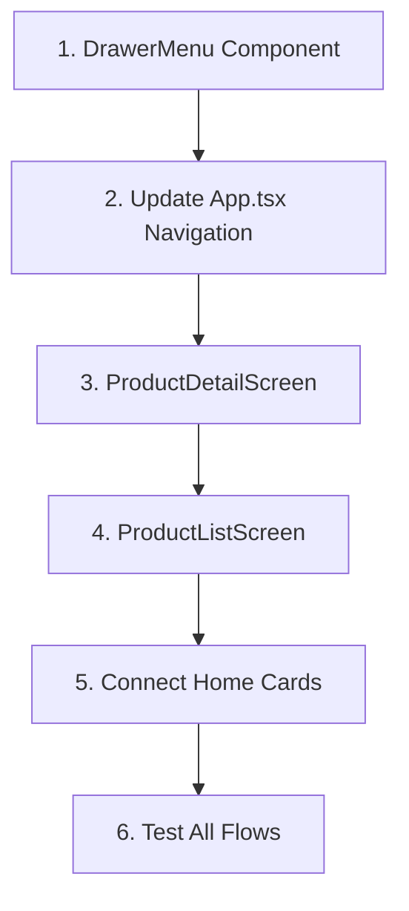

# Complete Navigation and Product Page Implementation

## Goal
Add full navigation functionality and product detail page to the Vitrine Digital Embelleze app, matching the Embelleze.com structure and Figma design.

---

## Embelleze.com Site Structure

### Main Navigation (Header)
| Menu Item | Description |
|-----------|-------------|
| Novidades | New arrivals |
| Categorias | Mega menu with all product types |
| Promoção | Sales and discounts |
| Cupons | Active promo codes |

### Sidebar Menu ("Ver Tudo")
| Section | Items |
|---------|-------|
| Mais Vendidos | Best sellers |
| Cronograma Capilar | Hair schedule guide |
| Necessidades do Cabelo | Hidratação, Nutrição, Reconstrução, Antifrizz, Queda |
| Categorias de Produtos | Tratamento, Shampoo, Condicionador, Recargas, Máscara, Finalizadores, Kit, Coloração, Transformação |
| Marcas | **16 brands**: Novex, Natucor, Maxton, Pelúcia, Rená, Bllex, Star Color, Hairlife, Amacihair, Lisahair, Maxglow, Fleury, Toin, Nutrisalon, Yantra, Alkimia |
| Linha Kids | Children's line |
| Profissional | Professional products |

---

## Proposed Changes

### Component 1: Drawer Menu (Right Side)

#### [NEW] [DrawerMenu.tsx](file:///C:/Users/criacao/OneDrive%20-%20Embelleze/MEUS-PROJETOS-IA/CATALOGO-VITRINE-APP/TESTE-MCP-FIGMA/APP-VITRINE-EMBELLEZE/src/components/DrawerMenu.tsx)

Full-screen drawer opened by "Mais" tab:
- Accordion sections matching Embelleze sidebar
- Sections: Mais Vendidos, Cronograma, Necessidades, Categorias, Marcas, etc.
- Purple brand color (#7C3AED) for headers
- Close button (X) on top right

---

### Component 2: Product Detail Screen

#### [NEW] [ProductDetailScreen.tsx](file:///C:/Users/criacao/OneDrive%20-%20Embelleze/MEUS-PROJETOS-IA/CATALOGO-VITRINE-APP/TESTE-MCP-FIGMA/APP-VITRINE-EMBELLEZE/src/screens/ProductDetailScreen.tsx)

Matching Embelleze.com layout:

| Section | Details |
|---------|---------|
| Header | Back button + Favorite heart + Share |
| Image Gallery | Main image + thumbnail strip |
| Product Info | Brand, Name, Stars (11 avaliações) |
| Price Box | ~~R$ 40,00~~ **R$ 24,90** (red) |
| Size Selector | Buttons: "1KG", "400G" |
| Buy Box | Quantity (- 1 +) + "Adicionar ao carrinho" (pink button) |
| Accordion Tabs | Descrição, Indicação, Composição, Benefícios, Ação, Ativos, Resultados, Modo de uso |
| Related Products | Horizontal carousel |

---

### Component 3: Product List Screen

#### [NEW] [ProductListScreen.tsx](file:///C:/Users/criacao/OneDrive%20-%20Embelleze/MEUS-PROJETOS-IA/CATALOGO-VITRINE-APP/TESTE-MCP-FIGMA/APP-VITRINE-EMBELLEZE/src/screens/ProductListScreen.tsx)

List page when clicking a category/brand:

| Section | Details |
|---------|---------|
| Header | Back + Category/Brand name |
| Filter Sidebar | Em Estoque, Marca, Categoria, Tamanho, Necessidade, Preço |
| Sort Dropdown | "Em destaque" |
| Product Grid | 2 columns, with discount badge, heart, price, "Adicionar" button |

---

### Component 4: Navigation Updates

#### [MODIFY] [App.tsx](file:///C:/Users/criacao/OneDrive%20-%20Embelleze/MEUS-PROJETOS-IA/CATALOGO-VITRINE-APP/TESTE-MCP-FIGMA/APP-VITRINE-EMBELLEZE/App.tsx)

Add navigation states for:
- `'drawer'` - Opens DrawerMenu
- `'productDetail'` - Opens ProductDetailScreen with product ID
- `'productList'` - Opens ProductListScreen with category/brand filter

#### [MODIFY] [BottomNavigation.tsx](file:///C:/Users/criacao/OneDrive%20-%20Embelleze/MEUS-PROJETOS-IA/CATALOGO-VITRINE-APP/TESTE-MCP-FIGMA/APP-VITRINE-EMBELLEZE/src/components/BottomNavigation.tsx)

- "Mais" tab opens drawer instead of navigating

#### [MODIFY] [HomeScreen.tsx](file:///C:/Users/criacao/OneDrive%20-%20Embelleze/MEUS-PROJETOS-IA/CATALOGO-VITRINE-APP/TESTE-MCP-FIGMA/APP-VITRINE-EMBELLEZE/src/screens/HomeScreen.tsx)

- Category cards → open ProductListScreen with category filter
- Product cards → open ProductDetailScreen with product ID
- "Ver todos" → open ProductListScreen

---

## Implementation Order



---

## Verification Plan

### Automated Tests
No automated tests currently in project. Manual verification will be used.

### Manual Verification

1. **Drawer Menu**
   - Tap "Mais" in bottom nav → drawer slides from right
   - Tap sections → accordion expands
   - Tap category/brand → navigates to ProductListScreen
   - Tap X → drawer closes

2. **Product Detail Screen**
   - Open from Home product card
   - Verify all sections display: image, price, variants, accordion
   - Tap size buttons → changes selection
   - Tap heart → toggles favorite state

3. **Product List Screen**
   - Open from category card on Home
   - Verify 2-column grid layout
   - Scroll through products
   - Tap product → opens ProductDetailScreen

4. **Full Flow Test**
   - Home → Category Card → Product List → Product Detail → Back → Home
   - Home → "Mais" → Drawer → Brand → Product List → Product Detail

---

## Sample Product Data (Gelato de Pistache)

```json
{
  "id": "gelato-pistache",
  "brand": "Novex",
  "name": "Creme de Tratamento Novex Gelato de Pistache",
  "rating": 5,
  "reviews": 11,
  "originalPrice": 40.00,
  "salePrice": 24.90,
  "discount": 38,
  "sizes": ["1KG", "400G"],
  "image": "https://embelleze.com/cdn/shop/products/gelato-pistache.png",
  "sections": {
    "description": "Tratamento ultraprofundo com Bomba Lamelar 8 em 1...",
    "indication": "Para todos os tipos de cabelo...",
    "composition": "Aqua, Cetearyl Alcohol...",
    "benefits": "Hidratação profunda, brilho espelhado...",
    "results": "Cabelos macios, hidratados e com brilho...",
    "howToUse": "Após lavar com shampoo, aplique nos fios..."
  }
}
```

---

## Recording: Site Research


